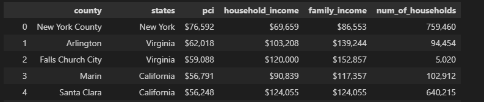
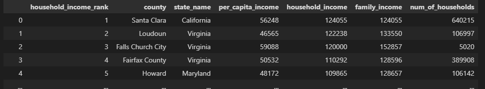
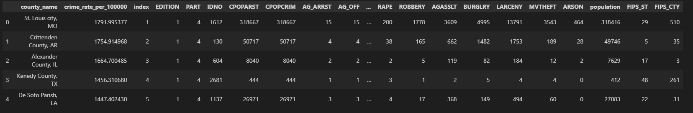
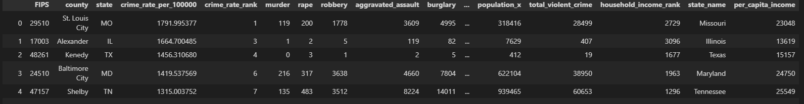

# Project 3: Web Visulizations
## Team 3
### Kevin Ybarra, Satya Sakuntala NagaSravya Mattapalli, Chris Schultz, Wei Kent Chen

 

# Project Overview

- Team 3 project compares United State counties per capita income and crime rate. Our project gathers data on counties per capital income and crime rate in the United States, as well GeoJSON data to map out counties in the United States. 
- Software: Python, Jupyter Notebook, 
- Python Libraries: Pandas, 
- GeoJSON Data
- Python Flask-powered API, HTML/CSS, JavaScript
- Database SQL, MongoDB, SQLite, etc
- JavaScript Libray - Leaflet 
- Your project should include at least one JS library that we did not cover.

 

# Extract Data

Our data was extracted from the following sources:
- [Kaggle - United States counties by per capita income](https://www.kaggle.com/datasets/kabhishm/united-states-counties-by-per-capita-income/)
  - csv files stored locally (not in repository) due to GitHub size limits
  - Used Pandas read_csv function to read in counties_per_capita_income.csv

- [Kaggle - United States crime rates by county](https://www.kaggle.com/datasets/mikejohnsonjr/united-states-crime-rates-by-county)
  - csv files stored locally (not in repository) due to GitHub size limits
  - Used Pandas read_csv function to read in crime_data_w_population_and_crime_rate.csv

- [GeoJSON - US Counties](https://eric.clst.org/tech/usgeojson/)

 # Transform Data

 After extracting all of our data, the following steps were performed to transform it into the desired cleaned tables. We prepared our data by ensuring our relations were in Third Normal Form (3NF).

 ## Counties per capita income

- Using Pandas to read in the <em>counties_per_capital_income.csv</em> file, we created the initial dataframe 'income_counties_df':

  

- In order to clean this data, we performed the following actions:
  - Filtered down to only include <strong>County</strong>, <strong>state_name</strong>, <strong>per_capita_income</strong>, <strong>household_income</strong>,<strong>family_income</strong>, and <strong>num_of_households</strong>  columns.
  
- The end result was our cleaned dataframe 'income_counties_df':

   

 

## Crime Rates by County 

- Using Pandas to read in the <em>crime_data_w_population_and_crime_rate.csv</em> file, we created the initial dataframe 'crime_counties_df':

         

- In order to clean this data, we performed the following actions:
  - Filtered down to only include <strong>county_name</strong>, <strong>state</strong>, <strong>crime_rate_per_100000</strong>, <strong>crime_rate_rate</strong>,<strong>murder</strong>, <strong>rape</strong>, <strong>robbery</strong>, <strong>aggravtaed_assult</strong>, <strong>burglary</strong>, <strong>larceny</strong>, <strong>motor_theft</strong>, <strong>arson</strong>, <strong>population</strong>, and <strong>total_violence_crime</strong>  columns.
  
- The end result was our cleaned dataframe 'crime_counties_df':

# Webpage Development

