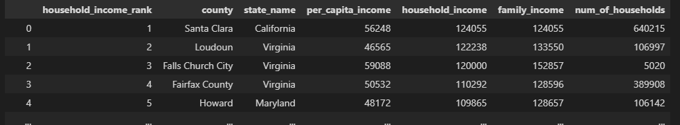
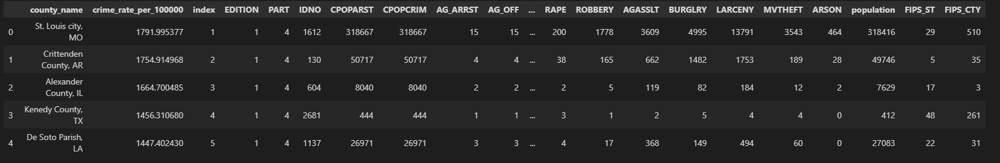
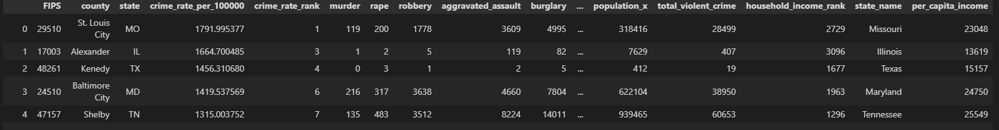
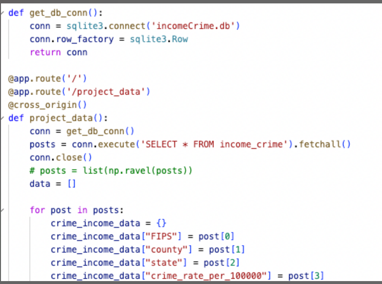
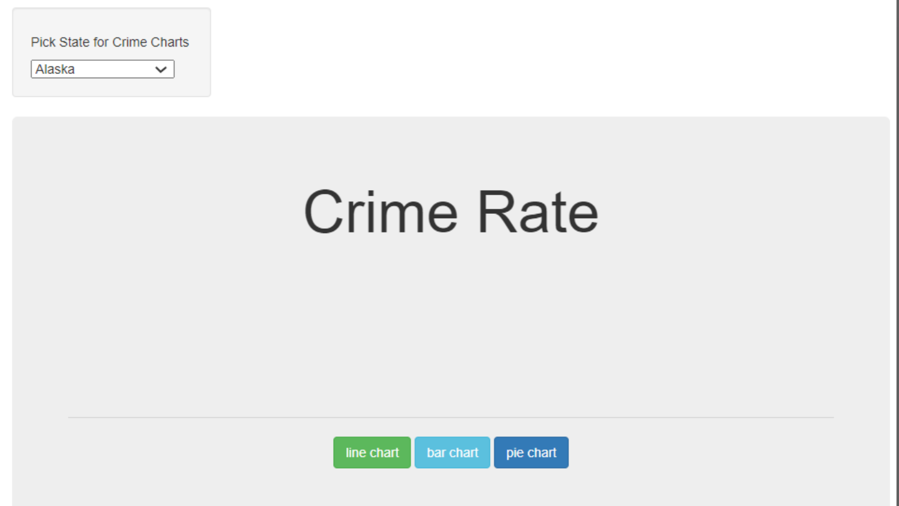
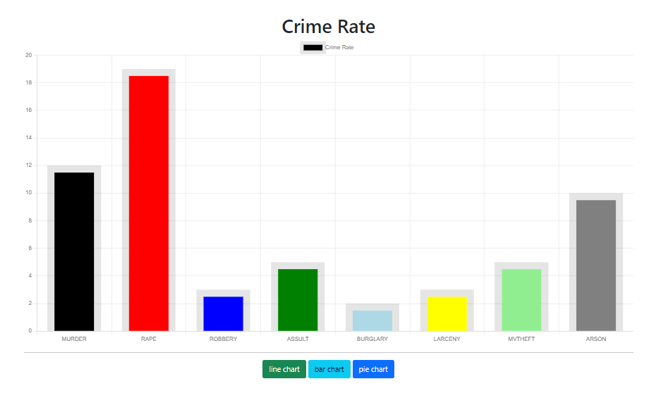

# Project 3: Web Visulizations
## Team 3
### Kevin Ybarra, Satya Sakuntala NagaSravya Mattapalli, Chris Schultz, Wei Kent Chen

# Project Overview

- Team 3 project compares United State counties per capita income and crime rate. Our project gathers data on counties per capital income and crime rate in the United States, as well GeoJSON data to map out counties in the United States. 

- Question - which states and counties had the most or which crime was the most prevalent based by income?

- Software: Python, Jupyter Notebook, Render.
- Python Libraries: Pandas, Python Flask, Sqlite3, Numpy.
- GeoJSON Data.
- Database SQL (SQLite).
- JavaScript Libray - Leaflet.
- Chart.JS

# Extract Data

Our data was extracted from the following sources:

- [Kaggle - United States counties by per capita income](https://www.kaggle.com/datasets/kabhishm/united-states-counties-by-per-capita-income/)
  - csv files stored locally (not in repository) due to GitHub size limits
  - Used Pandas read_csv function to read in counties_per_capita_income.csv

- [Kaggle - United States crime rates by county](https://www.kaggle.com/datasets/mikejohnsonjr/united-states-crime-rates-by-county)
  - csv files stored locally (not in repository) due to GitHub size limits
  - Used Pandas read_csv function to read in crime_data_w_population_and_crime_rate.csv

- [GeoJSON - US Counties](https://eric.clst.org/tech/usgeojson/)

- Flask Powered API endpoint and hosted using render                        https://web-visualization-project.onrender.com/project_data

 # Transform Data

 After extracting all of our data, the following steps were performed to transform it into the desired cleaned tables. We prepared our data by ensuring our relations were in Third Normal Form (3NF).

 ## Counties per capita income

- Using Pandas to read in the <em>counties_per_capital_income.csv</em> file, we created the initial dataframe 'income_counties_df':

  

- In order to clean this data, we performed the following actions:
  - Filtered down to only include <strong>County</strong>, <strong>state_name</strong>, <strong>per_capita_income</strong>, <strong>household_income</strong>,<strong>family_income</strong>, and <strong>num_of_households</strong>  columns.
  - Before merging all the datasets we made sure that all the data types were the same for the columns that were similar in the data sets.
  - Removed all spaces before and after the values to allow merging of data sets.
  
- The end result was our cleaned dataframe 'income_counties_df':

   

 

## Crime Rates by County 

- Using Pandas to read in the <em>crime_data_w_population_and_crime_rate.csv</em> file, we created the initial dataframe 'crime_counties_df':

         

- In order to clean this data, we performed the following actions:
  - Filtered down to only include <strong>county_name</strong>, <strong>state</strong>, <strong>crime_rate_per_100000</strong>, <strong>crime_rate_rate</strong>,<strong>murder</strong>, <strong>rape</strong>, <strong>robbery</strong>, <strong>aggravtaed_assult</strong>, <strong>burglary</strong>, <strong>larceny</strong>, <strong>motor_theft</strong>, <strong>arson</strong>, <strong>population</strong>, and <strong>total_violence_crime</strong>  columns.
  - Before merging all the datasets we made sure that all the data types were the same for the columns that were similar in the data sets.
  - Removed all spaces before and after the values to allow merging of data sets.
  
- The end result was our cleaned dataframe 'crime_counties_df':

## Merged Data

- Merged Crime Rates by County and Counties per capita income data.
- Load the data into the database.

# Load Data
- We used the SQLite database to load data.
- Confirmed data is loaded by fetching all the records.
- API endpoint used flask to read data from the database.
- Created APA endpoint hosted it using render.

# Webpage Development

Interactive Map - 

This interactive map allows the viewer to zoom in and out. Additionally clicking on the county line and or the state line provides more detail. 

Graph 2 - Scatter 

This scatter plot compares household income and violent crimes and having a drop down menu on the state

Graph 3 - Bar

This bar graph compares household income and violent crimes and having a drop down menu on the state

Graph 4 - Experimental

This experimental chart was to have a drop down on the state and then graphs would change based on the state selected. Additional detail information would include an additional drop down that would focus on the counties of the crime rate

